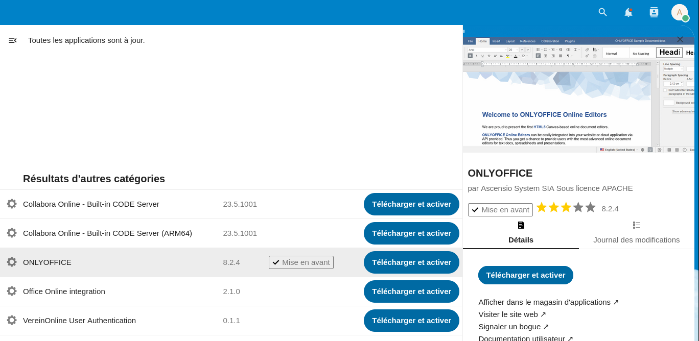
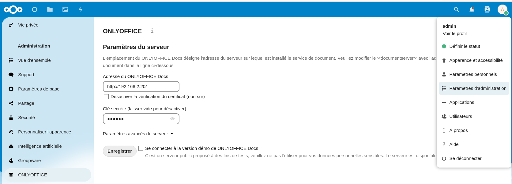
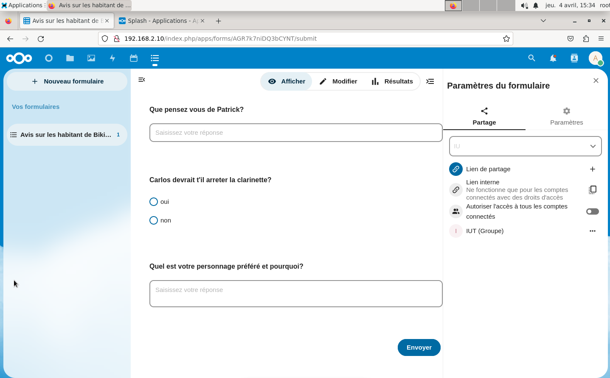
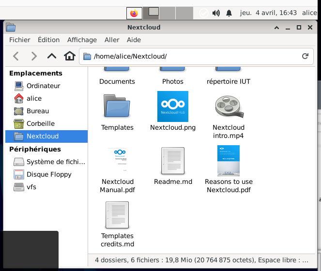

BARDOT Chloé, JEAN-FRANÇOIS Océane,S2C
15 avril 2024

# S2.03 - Installation of network services

## Table of Contents

I. [Presentation of the team members](#1)

II. [Tutorial](#2)

1. [Launching and configuring a virtual network](#3)

    1.1[User Management](#4)

    1.2.[Local network administration](#5)

      1.2.1 [Testing our configuration before modifying the configuration files](#6)

      1.2.2. [Permanent network configuration](#7)

2. [Installation and configuration of servers](#8)

    2.1. [Nextcloud service installation](#9)

    2.2. [Nextcloud service: configuration](#10)

    2.3. [OnlyOffice service: installation](#11)

    2.4. [Nextcloud plugins](#12)

      2.4.1. [OnlyOffice](#13)

      2.4.2. [Splash](#14)

      2.4.3. [Draw.io](#15)

      2.4.4. [Calendar](#16)

      2.4.5. [Form](#17)

      2.4.6. [Deck](#18)

      2.4.7. [News](#19)

3. [Installation et configuration des clients](#20)

III.	[Portfolio](#21)

## I. Presentation of the team members 

This document was written by Chloé Bardot and Océane Jean-Francois, two first-year students in the Computer Science department at  the Bordeaux University of Technology, as part of a project for the computer network course.

## II. Tutorial 

We will provide you with a detailed description of the complete network configuration and all the steps that need to be performed on the virtual machines in order to carry out the installation and configuration of network services. This network will consist of two sub-networks (client and server) connected by a router. The Client LAN is composed by the machines alice and bob, while the Server LAN is composed by the machines ncloud and office.

.

We will also explain in detail how to perform the installation and configuration of associated heavy clients. The ncloud machine will host our Nextcloud file server while the office machine will host the Onlyoffice document editing service. The alice and bob machines will act as two clients for our Nexctloud service.

### 1. Launching and configuring a virtual network: 

* Open a terminal, which we will subsequently refer to as the regular terminal.  
* Enter the following command:`/mnt/roona/vms/vnet/nemu-vnet ncloud` 
* The router machine console should open with this display:

.

* This terminal will be referred to as the root terminal.
* To log in: - **Login : root / Password: plop**
* In the regular terminal, type `cli()` to launch the client machines (alice and bob).
* In the regular terminal, type `srv()` to launch the server machines (nCloud and Office).

#### 1.1. User Management 

* On Bob's machine terminal, type `adduser bob` and set the password to **plop**.

.

* To verify that the previous steps have worked correctly, log in as the user Bob by typing `login bob` and then entering his password: **plop**.

.

* Repeat the two previous steps with Alice's machine.
* In order to grant access rights to users on both Alice's and Bob's terminals, exit the machines with the command `exit` then write the command `usermod -a -G sudo alice` on Alice's machine and `usermod -a -G sudo bob` on Bob's machine.

_Note_ : sudo allows authorized users to execute commands on behalf of another user within a system. Therefore, it can indeed be the root user. To use it, simply place it after another command like this: `sudo [Command]`

This allows the user to execute the intended command, even if they do not have root privileges.

#### 1.2. Local network administration 

##### 1.2.1 Testing our configuration before modifying the configuration files. 

_Note_ : We want to create two /24 subnets. CIDR IP address notation adds a suffix value indicating the number of network address prefix bits to a normal IP address. For an IPv4 address, the first 24 bits are reserved to characterize the network address, and the remaining 8 bits correspond to the host portion. Therefore, there can be 254 machines on the network.

We choose to assign the following IP addresses to each machine:

- eth0 on router: 192.168.2.254

- eth0 on ncloud: 192.168.2.10

- eth0 on office: 192.168.2.20

- eth1 on router: 192.168.1.254

- eth0 on alice: 192.168.1.10

- eth0 on bob: 192.168.1.20

_Note_ : The interface named 'lo' with the address 127.0.0.1 corresponds to the local IP address. Thus, instead of heading to a remote server and connecting to another computer, your machine is actually communicating with itself (a virtual server).

* To assign them, type the following command on all machines: `ifconfig eth0 ipAddress netmask 255.255.255.0`. 
* Type the command again on the router machine to configure the client side of the network:  `ifconfig eth1 192.168.1.254 netmask 255.255.255.0`.
* To verify that the network is properly set up, go to Alice's terminal, type the command `ping 192.168.1.20` (to establish a connection with Bob's machine), wait for a moment, then stop the procedure with Ctrl+C. If it says '0% packet loss,' the configuration is correct.
* Type the following command on the root terminal: `echo 1 > /proc/sys/net/ipv4/ip_forward` so that the router can forward packets that are not meant for it.

_Note_ : In order for two machines located on different networks to communicate with each other, their default gateway must be specified.

* To do this, on Alice and Bob's machines, type the command : `route add default gw 192.168.1.254`
* On the machines of the Office and Ncloud servers, type : `route add default gw 192.168.2.254`
* These two steps allow clients and servers to know where to send packets when they want to send them outside their local network (enabling the connection between the two networks through the router).
* To verify that the two networks are properly connected through the router, on Alice's terminal, type: `ping 192.168.2.20`, on Bob's terminal, type: `ping 192.168.2.10`, on Office, do : `ssh root@192.168.1.10`, and on Ncloud, do : `ssh root@192.168.1.20`.
* To determine the path of the packets (which routers they pass through), on Bob's terminal, execute the command: `traceroute 192.168.2.20`. You should get the following output :

.

##### 1.2.2. Permanent network configuration 

* On all machine terminals, type the command `reboot`. This command resets the virtual machine to zero (connections between machines and the router no longer exist).
* On the router machine, enter the command `cd /etc/network/` to navigate to the network folder of the machine, then enter the command `nano interfaces` to open the interfaces file.
* In this file, add the following lines (Be careful not to erase the existing lines !) :

_auto eth0_
_iface eth0 inet static_
_address 192.168.2.154_
_netmask 255.255.255.0_
_up echo 1 > /proc/sys/net/ipv4/ip_forward_

_auto eth1_
_iface eth1 inet static_
_address 192.168.1.154_
_netmask 255.255.255.0_
_up echo 1 > /proc/sys/net/ipv4/ip_forward_

* On other machines, navigate to the **network** directory and display the **interfaces** file, then write the following lines, replacing the IP addresses of the machines*.

_auto eth0_
_iface eth0 inet static_
_address adressIP*_
_netmask 255.255.255.0_
_gateway adressDuRouteur* (192.168.1.154 for alice and bob / 192.168.2.154 for  office and ncloud)_ 

.
.
.
.
.

* On all machines, the interfaces are started with the command `ifup --force eth0`, and on the router, it needs to be written a second time : `ifup --force eth1` to start its second interface. 
* We verify that the networks are properly configured with the command, on Bob's machine, `ping 192.168.2.20`. If we get the following display, then the networks are properly configured.

.

_Note_ : If all interfaces are turned off using the command `ifdown --force eth0`, the network can no longer communicate.

### 2. Installation and configuration of servers 

Note : apt is a package manager used by distributions such as Debian, Ubuntu, Mint, Raspbian, etc. It facilitates easy and efficient searching, simple installation, and clean uninstallation of software and utilities. It also enables effortless updating of distributions with the latest package versions and transitioning to a new distribution version when it becomes available.

There are different package managers for different distributions, each supporting different package formats : 

<table>
  <tr>
   <td>
   </td>
   <td><strong>Debian/Ubuntu</strong>
   </td>
   <td><strong>Fedora</strong>
   </td>
   <td><strong>Arch Linux</strong>
   </td>
   <td><strong>OpenSUSE</strong>
   </td>
  </tr>
  <tr>
   <td><strong>Package manager</strong>
   </td>
   <td>apt
   </td>
   <td>dnf
   </td>
   <td>pacman
   </td>
   <td>ZYpp
   </td>
  </tr>
  <tr>
   <td><strong>Package format</strong>
   </td>
   <td>.deb
   </td>
   <td>.rmp
   </td>
   <td>.tar.xx
   </td>
   <td>.rmp
   </td>
  </tr>
</table>

There is also a package manager for Windows called **winget** and another one for MacOS X called **Homebrew**.

The most commonly used apt commands are as follows :

<table>
  <tr>
   <td><strong>Commands</strong>
   </td>
   <td><strong>Description</strong>
   </td>
  </tr>
  <tr>
   <td>apt update
   </td>
   <td>Update the list of available software
   </td>
  </tr>
  <tr>
   <td>apt search
   </td>
   <td>Search for a package
   </td>
  </tr>
  <tr>
   <td>apt show
   </td>
   <td>View package details
   </td>
  </tr>
  <tr>
   <td>apt list --installed
   </td>
   <td>List packages installed on the system
   </td>
  </tr>
  <tr>
   <td>apt install
   </td>
   <td>Install a package
   </td>
  </tr>
  <tr>
   <td>apt remove
   </td>
   <td>Delete a package
   </td>
  </tr>
  <tr>
   <td>apt update
   </td>
   <td>Update all system packages
   </td>
  </tr>
</table>

Note : The usual commands for manipulating Snap managers are as follows :

<table>
  <tr>
   <td><strong>Commands</strong>
   </td>
   <td><strong>Description</strong>
   </td>
  </tr>
  <tr>
   <td>snap find [query]
   </td>
   <td>Search for package
   </td>
  </tr>
  <tr>
   <td>snap install [package]
   </td>
   <td>Install a package
   </td>
  </tr>
  <tr>
   <td>snap refresh [package]
   </td>
   <td>Update a package
   </td>
  </tr>
  <tr>
   <td>snap refresh [package] –chanel=[channel]
   </td>
   <td>Update a package to another channel (track, risk, or branch)
   </td>
  </tr>
  <tr>
   <td>snap refresh
   </td>
   <td>Update all package
   </td>
  </tr>
  <tr>
   <td>snap list
   </td>
   <td>Display basic information about installed snap software
   </td>
  </tr>
  <tr>
   <td>snap remove [package]
   </td>
   <td>Uninstall a package
   </td>
  </tr>
  <tr>
   <td>snap changes 
   </td>
   <td>Check for recent snap changes in the system
   </td>
  </tr>
</table>

#### 2.1. Nextcloud service installation 

* On the terminal of the nCould machine, type `sudo apt install snapd`, which will install the snapd package.
* To install NextCloud, type `sudo snap install nextcloud`.
* To access the machine's graphical desktop, type `startx`.
* Open a web browser and enter the server's IP address in the search bar.
* Choose a username and password for the admin account. For example, username : admin and a password of your choice.
* During your login, do not install the recommended applications.
* You should see the display as shown below :

.

#### 2.2. Nextcloud service: configuration 

* Click on your user thumbnail, then go to **Administration Settings** (Paramètres d’administration).
* Navigate to Sharing and check **Always ask for a password** (Toujours demander un mot de passe) and **Enforce password protection** (Imposer la protection par mot de passe).

* Go to the Security section and check the boxes for **Enforce uppercase and lowercase characters, Enforce numbers** (Imposer des caractères en majuscules et minuscules, Imposer des chiffres) , and **Check the password against the list of compromised passwords on haveibeenpwned.com** (Vérifier le mot de passe par rapport à la liste des mots de passe compromis sur haveibeenpwned.com).

Note : The haveibeenpwned service is a free online service that allows you to determine if your personal data has been compromised in data breaches and hacks.

* Now, let's create a user group. Go to the user window, click on **Add a group** (ajouter un groupe ) and enter the name of the group you wish to create.

* Click on **New user** (Nouvel utilisateur)** **and then enter the settings below so that Alice has administrative rights over the IUT group.

* Do the same for Bob, but do not include the second “IUT” and allocate only 128MB of memory.

* Disconnect from the administrator account and then log in to the two accounts you created. You can customize your accounts.

* From Alice's account, you can create a shared folder. To do this, go to files, then click on **new**(nouveau), then **New folder** (Nouveau dossier), and enter the name of the folder you want to create. In the settings, to be able to share the folder with members of the group, search for the name of your group in the search bar. You can allow editing.

* You can log into Bob's account to check if the folder appears and if you can modify it.
* You can create a file, click on **share**(partager), then **create a sharing link** (créer un lien de partage) and set a password. You can then copy the sharing link.

* Open a private browsing window and then paste the link into the search bar. Enter the password, you should have access to the document.

#### 2.3. OnlyOffice service: installation 

* On the office machine terminal, type `sudo apt install snapd`, which will install the snapd package.
* To install NextCloud, type `sudo snap install onlyoffice-ds`.
* Configure your secret key to protect access to the service. To do this, type `snap set onlyoffice-ds onlyoffice.jwt-secret=YourKeyName` and then `snap set onlyoffice-ds onlyoffice.jwt-enabled=true`.
* To access the machine's graphical desktop, type `startx`.
* Open a web browser and, as with the NextCloud server, enter the office server's IP address in the address bar. If you see the server's homepage, your configuration is correct.

#### 2.4. Nextcloud plugins 

##### 2.4.1. OnlyOffice 

* Log in as admin to the NextCloud server and go to the user dropdown menu, then click on **Applications**.

* Click on the magnifying glass at the top right, then search for **ONLYOFFICE**. Click on **download and activate **(télécharger et activer), as indicated below.

* Go to the administration settings, then click on ONLYOFFICE in the left menu, enter the ONLYOFFICE server address and your secret key, and click **save**(enregistrer).

* Tick the settings : doc, docx, ppt, pptx, xls, xlsx, odp, ods, odt.

* You can open a document of this type from any user account to verify the proper functioning of the service.

##### 2.4.2. Splash 

* Connect as an admin to the NextCloud server and go to the user's dropdown menu, click on **Applications**.
* Click on the magnifying glass at the top right corner, then search for **Splash**. Click on **download and activate**(télécharger et activer), as shown below.

* Log out and you should have a natural background on the login page.

##### 2.4.3. Draw.io 

* Log in as an admin on the NextCloud server and in the user dropdown menu, click on Applications. Click on the magnifying glass at the top right and then search for **Draw.io**. Click on **download and activate** (télécharger et activer), as shown below.

* Disconnect and reconnect, and you should be able to create a new diagram / a new whiteboard as shown below.

##### 2.4.4. Calendar 

* Log in as an admin on the NextCloud server and go to the user dropdown menu, then click on Applications. Click on the magnifying glass at the top right corner and search for **Calendar**. Click on **download and activate**(télécharger et activer), as shown below.

* Click on the calendar icon that has just appeared in the top left corner, then click on **New Calendar** ( Nouvel agenda), give it a name, and click on the pencil icon to the right of the calendar you created. You can share the calendar with a group and check the **can edit** (peut modifier) option.

* You can log in with a user account that is part of the calendar group and create new events using the **+ Event** button (+ Événement), fill out the form making sure to check the name of the calendar you created instead of **Personnel**.

* You can do the same with another user account, and you should see the event that the other user created.

##### 2.4.5. Form 

* Connect as an admin to the NextCloud server and go to applications in the user dropdown menu, click on Applications.
* Click on the magnifying glass at the top right and then search for **Form**. Click on **download and activate** (télécharger et activer), as indicated below.

* To create a form, click on the icon that has been added at the top left and then click on **+ New Form** (+ Nouveau formulaire).

* Write your questions by choosing your response mode.

* To publish your form, click on **Display** (Afficher) at the top of the window, scroll all the way down the form, and click on **Send** (Envoyer).

* You can see the results of the form by clicking on **Results** (Résultats) at the top of the form window.

##### 2.4.6. Deck 

* On the same principle of installing plugins, you can install the Deck plugin which allows you to have a To-Do List :

##### 2.4.7. News 

* You can also install the News plugin which allows you to display news and subscribe to certain media.

### 3. Installation et configuration des clients 

* Connect to Alice's and Bob's machines with their respective accounts. On their terminal, type the command `sudo apt install nextcloud-desktop`  to install the NextCloud client version on Alice's and Bob's machines.
* Login to Alice using the graphical interface (`startx`) and then launch the NextCloud application. Click on **Authenticate on your NextCloud** (Authentifié sur votre NextCloud) , then enter the server address (here 192.168.2.10).

* The window opposite should open in your browser. Click on **Sign in** (Se connecter )  and enter your username and password.

* You must obtain the following display :

* Go back to the NextCloud application and click on **Sign In** (Connexion).

* Choose a password and click on **Continue** (Continuer).

* You must be logged into Alice's account on the web browser.

* Go to the machine's files and make sure you have the NextCloud folder with files that are synchronized with the files in your NextCloud (on the web browser).

* To test that your configuration is correctly set up, create a file in the shared NextCloud directory on your machine and verify that it appears on the NextCloud web page.

* You can also do the opposite: create a file on the NextCloud web page and check that it appears in your folder on your machine.

* Repeat the same procedure for Bob's machine.

Congratulations, you have successfully completed the installation and configuration of your network service !

## III.	Portfolio 

The aim of the project was to install and configure network services (NextCloud and OnlyOffice), along with their associated desktop clients, and introduce them to a virtual environment simulating a network of machines on Debian. This project enabled us to develop skills in system administration, network configuration, server and client installation and configuration, as well as producing detailed documentation in Markdown.
